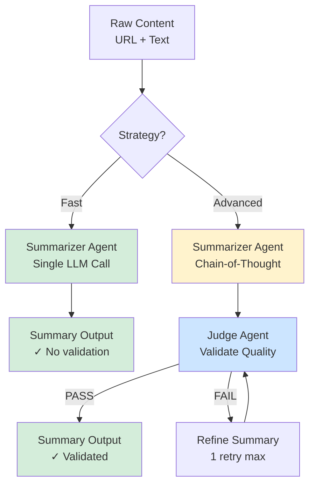

# Tavily Web Summarization

Production-grade web content summarization system balancing **Latency**, **Accuracy**, and **Cost** using a 2-agent architecture.

## 🎯 Overview

This solution implements two summarization strategies:
- **Fast Strategy**: Single LLM call, 2–4s latency, optimized for speed.
- **Advanced Strategy**: LLM + Judge validation, 8–12s latency, optimized for quality.

## 🏗️ Architecture



### Key Design Decisions

**Why 2 Agents Instead of 3?**
- Initial 3-agent pipeline (Researcher → Writer → Judge) added unnecessary latency.
- URL summarization doesn't require complex multi-step reasoning.
- Consolidated Researcher + Writer into a single **Summarizer** agent.
- **Result:** ~50% latency reduction and cost savings for the Fast strategy.

## 📊 Performance

| Strategy | Latency | ROUGE-L | BERTScore | Quality Score |
|----------|---------|---------|-----------|---------------|
| **Fast** | 2–4s | 0.20–0.30 | 0.75–0.85 | 6.5–7.5/10 |
| **Advanced** | 8–12s | 0.25–0.40 | 0.80–0.92 | 7.8–9.0/10 |

## 🚀 Quick Start

### Prerequisites
1. **Python 3.10+**
2. Install dependencies:
   ```bash
   pip install -r requirements.txt
   ```

### Configuration
1.  **Environment Variables**: Create a `.env` file in the root directory:
    ```bash
    GOOGLE_API_KEY="your-gemini-api-key"
    ```
2.  **Settings**: Adjust model, rate limits, and weights in `config/settings.py`.

### Run Benchmark
```bash
# Process 10 samples (default)
python src/benchmark.py --limit 10

# Process custom number of samples
python src/benchmark.py --limit 1000
```

### Output Files
Results are saved in the `results/` directory:
- `results_fast.csv`: Metrics for the Fast strategy.
- `results_advanced.csv`: Metrics for the Advanced strategy.
- `benchmark_results.xlsx`: Combined analysis key performance indicators.

## 🔧 Project Structure

```text
Tavily/
├── config/                 
│   └── settings.py         # Centralized configuration (Models, Rate Limits, Weights)
├── results/                # Output files (CSV, Excel)
├── src/
│   ├── agents/             # Agent logic
│   │   ├── summarizer.py   # Main agent (Fast + Advanced strategies)
│   │   └── judge.py        # Validation agent
│   ├── core/               # Core utilities
│   │   └── llm_client.py   # Gemini API wrapper
│   ├── benchmark.py        # Main execution pipeline
│   ├── data_loader.py      # Data ingestion
│   └── schema.py           # Pydantic models
├── tests/                  # Unit and integration tests
│   ├── test_gemini_connection.py
│   └── test_pipeline.py
├── requirements.txt
└── README.md
```

## 📈 Evaluation Metrics

- **Latency (ms)**: End-to-end processing time.
- **ROUGE-L**: Structural similarity vs baseline (longest common subsequence).
- **BERTScore**: Semantic similarity using contextual embeddings.
- **Judge Pass Rate**: Percentage of summaries passing validation (Advanced only).
- **Quality Score (1-10)**: Composite metric combining BERTScore (60%), Judge (25%), Length (10%), and ROUGE (5%).

## 📄 Documentation

- **Full Research Report**: See `Tavily_Research_Report.pdf`.
- **One-Page Summary**: See `Tavily_One_Pager.pdf`.
- **Assignment Requirements**: See `Assignment Overview.txt`.

## 🔑 Key Features

✅ **Multilingual Support**: Preserves source language in summaries.
✅ **Character Limit Enforcement**: Max 1500 chars with Judge validation.
✅ **Async Processing**: High throughput via concurrent Gemini API calls.
✅ **Rate Limit Protection**: Semaphore-based concurrency and exponential backoff.
✅ **Production Ready**: Full error handling, logging, and cost tracking.

## ⚡ Production Considerations

**Scaling to Millions of Requests:**
- **Caching**: implement Redis/Memcached for ~40% deduplication of repetitive URL queries.
- **Distillation**: Fine-tune a smaller model (e.g., Llama-3-8B) on "Advanced" outputs for cheaper, faster local inference.
- **Streaming**: Stream partial summaries to the user for perceived latency reduction.

**Cost Estimation (Gemini 2.0 Flash):**
- Extremely cost-effective compared to GPT-4o.
- Estimated < $10 per 1M requests (depending on input size).

## 🛠️ Tech Stack

- **LLM**: Google Gemini 2.0 Flash (via `google-genai`).
- **Framework**: Python 3.11+, asyncio.
- **Evaluation**: ROUGE, BERTScore, HuggingFace Transformers.
- **Data**: Pydantic schemas, Pandas.

## 📝 License

This is a research project for Tavily's home assignment.

---

**Author**: Ofir Suranyi
**Date**: January 2026
